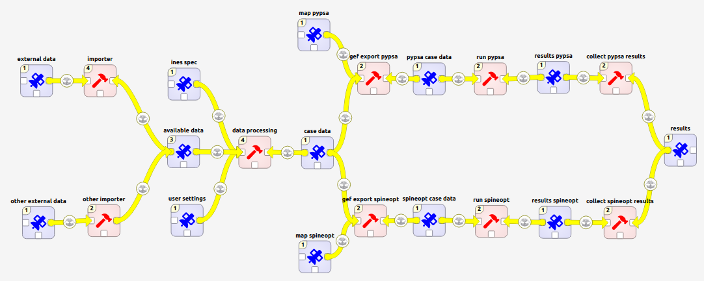

# ines data tools

**Future energy systems are flexible energy systems.** That is because future energy systems are required to take responsibility for their impact on the environment and to offer security of supply in regards to primary sources. Essentially that implies that the use of fossil fuels is replaced with more local and sustainable energy sources (assuming that carbon capture utilization and storage as well as demand reduction measures are not the only solutions). As these sustainable sources are often naturally fluctuating, flexibility is becoming increasingly important.

**Flexible energy systems require flexible data and modelling tools.** Energy system models attempt to calculate the best mix of flexibility providing technologies. Studies using these tools often use scenarios for the justification of the selected data (uncertainty, ...) and assumptions (future projections, ...). With a wide range of possibilities there is a wide spread on possible outcomes, so we might want to repeat a study from a different perspective. Flexible tools with repeatable workflows serve that purpose.

[Spine tools](https://github.com/spine-tools) aims to be a flexible tool for energy systems by not only providing a flexible optimisation model through [SpineOpt](https://github.com/Spine-tools/SpineOpt.jl) but also a workflow for data and scenario building with [Spine Toolbox](https://github.com/Spine-tools/Spine-Toolbox).

ines data tools, typically using but not limited to spine tools, more specifically aims to provide a flexible data and modelling workflow for flexible energy systems.

## Workflow

0. **Templates** contain the ines specification as well as the user settings, the results specification and templates for energy system modelling tools.
1. **External data** with the highest desired resolution is loaded into the tool. The data comes from various sources and comes in different formats.
2. **Importers** bring the external data to a more unified format. Small adjustments in the import procedure still allow to load different data in the tool when needed for a very specific study.
3. **Available data** is taken as-is as much as possible as to allow to build a wide range of scenarios later on.
4. **Data processing** is done with various tools. On one hand these tools allow to model more complex parts of the energy system to be represented by (piece-wise) linear formulations in, e.g., SpineOpt. On the other hand the tools allow to filter and aggregate data according to the scope of the study. The scenarios for the energy system model are created at this stage as well. The scenarios cover different regions, applications, levels of detail and projections.
5. **Case data** form a more specific database and considered to be ready to be used in energy system modelling tools.
6. **Exporters** translate the more general structure of the built data and scenarios to a format specific to an energy system modelling tool, e.g. SpineOpt.
7. **Tools** use the case data to perform the necessary calculations.
8. **Collect results** to compare the outcome of different tools.
9. **Results** contains the results of different tools in a specified format.

The described workflow is also the structure of this repository.

## Use

In the future, the component tools may become available as a ribbon in Spine Toolbox. In the meanwhile the recommended approach is to clone this repository and point to the files from within your Spine Toolbox project.

<!-- To Do: Add a more detailed explanation (with example) to the documentation. -->