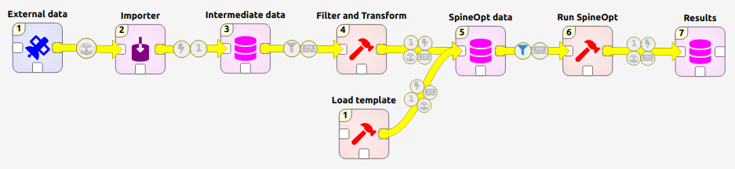

# Stepstone exercise
The stepstone exercise is meant to be an introduction to spine tools in the context of the flexible data pipeline for energy systems.

1. **External data** is a link to data from an external source.
2. **Importer** is used to import the external data to a spine database.
3. **Intermediate data** is a spine database. Note that the format of the database is not necessarily the same as the SpineOpt database.
4. **Filter and Transform** is a process that takes some data of the intermediate database and transforms it to the SpineOpt format.
5. **SpineOpt data** contains the energy system that is to be solved by SpineOpt. To be able to use the spine db editor to design the system, we can first populate the database with the SpineOpt format by means of the convenience tool **Load template**.
6. **Run SpineOpt** calls SpineOpt to solve the energy system in the SpineOpt database.
7. **Results** is a database in which the SpineOpt results are stored.

As all these steps are kept rather simple, they stand on their own so we'll have to start in medias res.

## 5-6-7. SpineOpt data, Run SpineOpt and examine Results
This exercise builds further on the [Simple system tutorial](https://spine-tools.github.io/SpineOpt.jl/latest/tutorial/simple_system/) so we refer to that exercise to create the SpineOpt data base, run the model and examine the results.

## 1. External data
Making external data available is actually quite simple: drag the data connection icon to the project and add the file path. Optionally you can add copy the file to the project. Take not that if you copy the file, any changes in the original file are no longer followed, changes then have to be made to the new file instead. More information on how the data connection works can be found here: [Adding data files to a data connection](https://spine-toolbox.readthedocs.io/en/latest/getting_started.html?highlight=data+connection#id9).

Here we add some data from [PyPSA-EUR](https://github.com/PyPSA/pypsa-eur): powerplants.csv

## 2-3. Importer and Intermediate data
To do some data processing we bring the external data into the spine format. In other words we import the external data to an intermediate database.

More information on importers can be found here: [Importing and Exporting Data](https://spine-toolbox.readthedocs.io/en/latest/data_import_export.html?highlight=importer#importing-and-exporting-data).

!!! note
    We could directly import to the SpineOpt format but for the sake of the exercise and according to the principle of the flexible data pipeline we import to an intermediate format instead.

The data from powerplants.csv is of the format:
* id
* name
* fuel type
* technology
* set
* country
* capacity
* efficiency
* DateIn
* DateRetrofit
* DateOut
* lat
* long
* duration
* volume
* dam height
* storage capacity
* EIC
* project ID

The sets will be mapped to object classes:
* CHP
* PP
* Store

For the parameters of the object classes we take some of the columns of the original data:
* efficiency
* planttype
* country
* capacity

The objects themselves are differentiated by their name.

## 4. Filter and Transform
For the data processing we rely on SpineInterface. We create a new tool and add our own script. The script is supposed to take some data from the intermediate database and add it to the SpineOpt database.