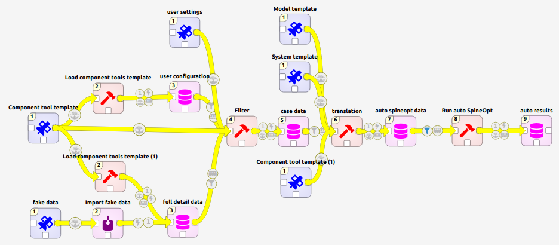
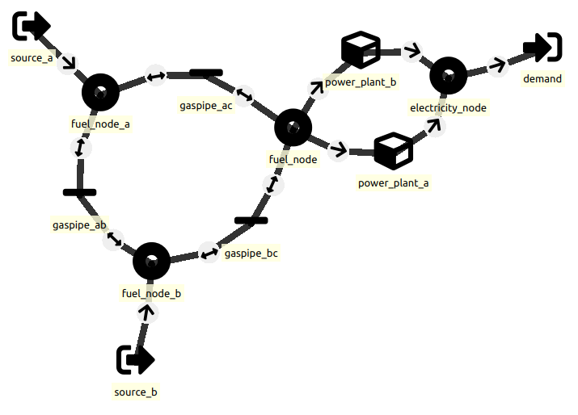
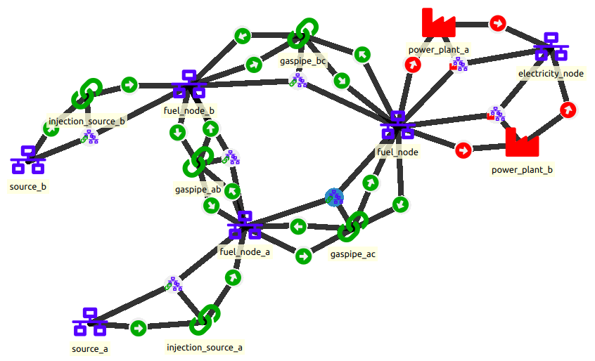

# Workflow 20230815

!!! note
    For this exercise it is assumed that the stepstone exercise is fully understood and mastered. Some parts, e.g. how to import data, are not repeated in this exercise.

Workflow 20230815 is an intermediate workflow towards the vision of the flexible workflow. The figure below shows the current state of the workflow. The main addition is the component tool template which glues all the processes together.

1.  **Component tool template** defines the format of the component data that is used in the workflow, i.e. in between *external data* and *exported data*. The template is loaded into a database with a simple **Load component tools template** (comparable to Load SpineOpt template).

2.  *External data* comes in the form of **fake data** which is merely example data that is fed in the workflow to test its functioning.

3.  **Importers** convert the external data to a spine database with the component format.

4.  **Full detail data** corresponds to the *select unprocessed data* from before and contains all the data that is imported from external data sources. Its format corresponds to the component tool template.

5.  *Data processing* is done with various tools. Here, a network is built by a **user configuration**. The data corresponding to the entities defined in the user configuration are **filter**ed from the full detail data and stored in a separate database.

6.  **Case data** contains all the necessary data (in the component format) to perform a particular case study.

7.  **Translation** from the component format to the SpineOpt format to run a case study with the case data through SpineOpt. To be able to perform the translation, the translation step uses the case data, the component tool template and some templates for SpineOpt.

These points are further addressed in the following sections.

## Component tool template

Before diving into the component tool template, let us clarify what we mean with different spine formats. Consider the image below. The workflow uses two formats: the component format and the spineopt format. Both the component format and the SpineOpt format are derived from the original spine format. The spine format defines the overall structure of objects classes, relationships classes, parameters, ... but does not actually specify any of them. The specification is done in the other formats. For example, the SpineOpt format specifies the spine object classes to SpineOpt units, connections, nodes, ...

As for the what the component format looks like, well, the current vision for the component format is that it is rather close to what is typically expected from data in the field of energy systems. For example we define an object class *power plant* with a parameter *efficiency*. For comparison in SpineOpt that object class would be a *unit* and the parameter would not be a property of that unit but rather a property of the relationship between the unit and the input/output nodes. In other words, the component format puts an emphasis on the spine objects (classes) and less so on the relationships (classes).

## External data

The external data is not particularly important for this exercise. The focus here is on the workflow itself. We mostly use fake data to be able to go through the workflow and run a small model.

## Importers

Each data set will require separate processing to bring the data to the component format. Some datasets will require specific processing but most tabular data can be easily imported with the built-in importer tools. However, the importers do not assume the end format (the component format in our case). So, be careful when mapping external data to the component tool format as a spelling error will simply create a new object class instead.

## Full detail data

The full detail data collects all the data from external sources into one database in the component format. This makes the data processing step (next section) a lot easier and less specific to the gathered data.

## Data processing

There is a lot that can and needs to be done on the data processing side. The end goal is to reduce the full detail data to a database that is specific to a particular case (the European and industrial case study, the benchmarks for comparisons of different tools, unit tests, \...). Here, we only consider a filter based on a selection by the user to perform a small case study on select data from the full detail database.

### user configuration

The user configuration could be very similar to the external data: some sort of table that is imported to a spine database. However, here we decide do use the power of the spine db editor more effectively. We allow the user to draw their case study. The process is the following. Firstly, we load the component tool template onto a new database. Secondly, we opens the spine db editor for that database. In the editor we can add objects in the component format but we need to give them the same name as the objects in the full detail database. Then we can also link them together with the available relationships.

An example of a network with sources, demand, power plants and connections is provided below. Two sources bring fuel to a ring of gas pipes. At another node gas is extracted by two power plants who convert the gas to electricity to supply the electricity demand. Note that we only need to create the objects and their relationships. All the parameters will be automatically extracted from the full detail database.

This example further shows the purpose of component format. It is supposed to be simple and clear.

### filter

From the full detail data and the user configuration we now need to create a new database which only contains the data for a specific case. That is what we do in the filter tool. It is a Julia script that makes use of Spine Interface to interact with the spine databases.

The main idea is that we bring everything together in a julia dictionary. Firstly, we load the component tool template into that dictionary. Secondly, we add the objects and relationships from the user configuration. Thirdly, we add the parameters from the full detail database that correspond to the objects in the user configuration. Finally, we export the full julia dictionary to a new spine database.

## Case data

The case data is the final database that fully describes a case study. The case data is supposed to be used by several energy system models. That implies that the workflow is not only meant for big case studies (i.e. the European and Industrial case study) but is also ideal for developing a consistent set of tests that could be used as part of a certification process for several tools.

## Export

For different tools to be able to read the case data we need to translate the component format to the format of the respective tool. As the component format differs from the SpineOpt format, we too need to make the translation.

The approach is similar as for the filter. We build a julia dictionary with templates, add data and export the data to a new database. Only this time we are using the SpineOpt template.

Another difference is that we also include a separate julia file with the mapping instructions. The idea is that there is a mapping function for each object class and parameter in the component format. The component format is not supposed to change that often so these functions will keep the same name and structure. That way a new tool only needs to look at this separate mapping file and fill in each of the functions.

Mapping functions can be very simple. The function that maps a node simply pushes the node with its name to the big dictionary.

Other maps can be more complex. The source is represented by a node and a connection to that node. That connection needs to be defined within the mapping process.

Some maps can even be tricky. The efficiency of a unit is an object parameter in the component format and a three-way-relationship between two nodes and a unit in the SpineOpt format. Currently we use a workaround where we use the dictionary itself to keep count of which nodes of the relationship have already been through the translation process and thus are available in the dictionary.

The image below shows the result of using the translation step on the example from before (ignore the fact that the figure is mirrored, the nodes and objects can be move to arbitrary locations). The figure is automatically generated from the input files and the user configurations; nothing has been manually added to the SpineOpt database. The model also runs and produces the expected results (do note that the unit flows of this example are correct but that the connections flows are not stable because there is a lossless ring).

